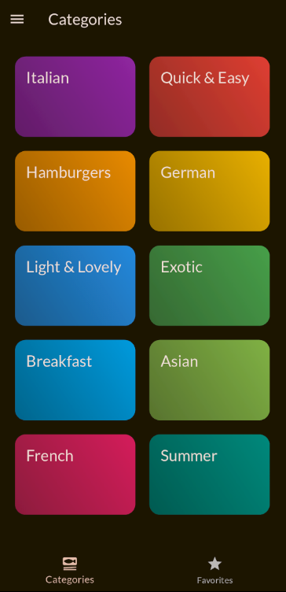
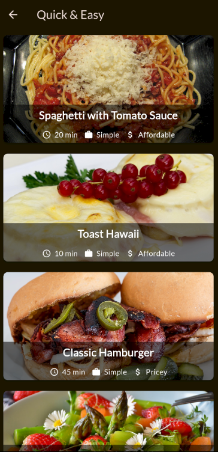
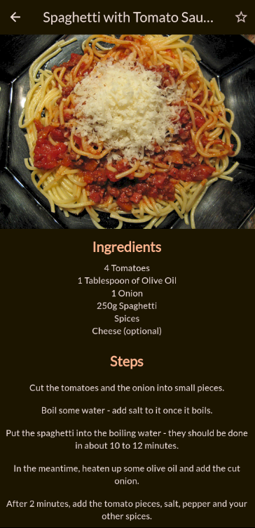
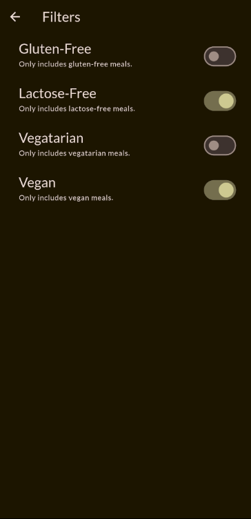

<h1>Recipe App</h1>

<h3><strong>Recipe App</strong> is a Flutter-based mobile application that helps users explore various meal categories and recipes. It integrates with Supabase for backend data management and uses Riverpod for state management. The app allows users to browse recipes by categories, view detailed recipe pages, and apply filters for a personalized experience.</h3>

<h3>Technologies Used</h3>
<ul>
  <li><strong>Flutter</strong> – A UI toolkit to build natively compiled applications for mobile using a single codebase.</li>
  <li><strong>Supabase</strong> – An open-source backend-as-a-service that provides real-time databases, authentication, and storage solutions.</li>
  <li><strong>Riverpod</strong> – A state management library for Flutter that simplifies and improves handling of state in a reactive and testable manner.</li>
  <li><strong>Enums</strong> – Used to define different meal categories for structured and manageable code.</li>
  <li><strong>Flutter Widgets</strong> – Utilizing Flutter’s built-in widgets for dynamic UI elements like lists, grids, and the Drawer widget.</li>
</ul>

<h3>Features</h3>
<ul>
  <li><strong>Meal Categories</strong>: The main view allows users to browse different categories of meals, each represented by an enum value for better code organization.</li>
  <li><strong>Filtered Meal Lists</strong>: Users can view all meals matching a specific category. Filters are integrated to narrow down meal options based on preferences.</li>
  <li><strong>Recipe Details</strong>: Each recipe has a detailed page showcasing ingredients, instructions, and nutritional information.</li>
  <li><strong>Drawer with Filter Options</strong>: A Drawer widget that offers additional filters to sort and refine recipe choices.</li>
  <li><strong>Real-time Data</strong>: All data is managed with Supabase for real-time synchronization between app and backend.</li>
  <li><strong>State Management</strong>: Riverpod is used to manage states for fetching data, applying filters, and handling UI updates efficiently.</li>
</ul>

<h3>Screenshots</h3>

<table>
  <tr>
    <td>
      
    </td>
    <td>
      <b>Main View:</b>
      

        The main view displays all the meal categories fetched from Supabase. Each category is represented by an enum, ensuring consistent and organized management of categories. The categories are visually presented in a grid or list, allowing users to tap on a category to view all meals within it.
      

    </td>
  </tr>
  <tr>
    <td>
      
    </td>
    <td>
      <b>Meals List View:</b>
      

        Upon selecting a category, users are presented with a list of meals that match the selected category. Each meal is displayed with its name, image, and a brief description. The list is dynamically populated based on data from Supabase, and filtering options are available to narrow down results.
      

    </td>
  </tr>
  <tr>
    <td>
      
    </td>
    <td>
      <b>Category Detail View:</b>
      

        This view provides additional information on a selected meal category, including a list of all available recipes within the category. It allows users to explore more detailed options for each meal and navigate seamlessly through the app.
      

    </td>
  </tr>
  <tr>
    <td>
      
    </td>
    <td>
      <b>Recipe Details Page:</b>
      

        The recipe details page provides all the necessary information about a selected recipe, such as ingredients, preparation instructions, and nutritional information. Users can also save the recipe to their favorites or share it with others.
      

    </td>
  </tr>
  <tr>
    <td>
      
    </td>
    <td>
      <b>Drawer with Filter Functionality:</b>
      

        The Drawer widget offers filter options that help users sort and narrow down recipes based on dietary preferences, cuisine, or meal type. These filters are managed with Riverpod, ensuring a smooth and responsive user experience when changing preferences.
      

    </td>
  </tr>
</table>

<h3>How It Works</h3>

<h4>1. Main View</h4>

The main view displays all meal categories, each represented by an enum. When a user taps a category, they are taken to the list of meals that belong to that category. The data is fetched dynamically from Supabase, providing real-time updates to meal availability and categories.

<h4>2. Meals List View</h4>

The meals list view displays all the meals matching a selected category. It features a clean, scrollable list of meals that users can tap on to view more details. This page also includes filter functionality, allowing users to refine their search based on meal preferences.

<h4>3. Category Detail View</h4>

Upon selecting a category, the app displays additional details about the selected category, such as all available recipes. The detail view makes it easier for users to browse and discover meals within the category and navigate seamlessly within the app.

<h4>4. Recipe Details Page</h4>

The recipe details page contains all the information a user needs to prepare a meal, such as ingredients, preparation instructions, and nutrition facts. It is designed for clarity and ease of use, allowing users to follow along while cooking or saving the recipe for later.

<h4>5. Drawer with Filter Functionality</h4>

The Drawer provides a user-friendly interface for applying filters to meal categories. Users can filter by meal type (e.g., vegetarian, gluten-free), cuisine (e.g., Italian, Asian), or other dietary preferences. The filter functionality is powered by Riverpod, ensuring smooth updates to the meal list as filters are applied.

